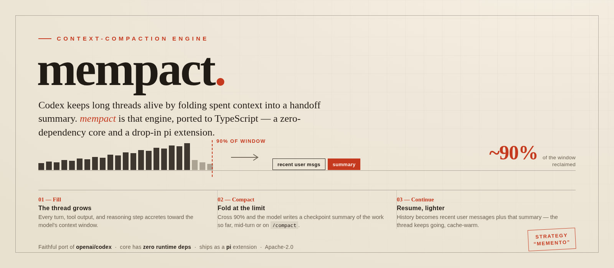

<p align="center">
  
</p>

<p align="center">
  <a href="reference/PIN.md"></a>
  
  
  
</p>

# mempact

A faithful TypeScript port of the OpenAI Codex CLI **compaction engine**
(internal codename "Memento"), packaged as:

- **`core/`** - a zero-runtime-dependency library, transliterated
  function-by-function from the Rust source with constants, algorithms, and
  prompts copied verbatim. Every function cites its Rust origin
  (`codex-rs/<file>:<line>`).
- **`pi/index.ts`** - a [pi coding agent](https://github.com/badlogic/pi-mono)
  extension that runs the exact codex compaction behavior inside pi.

Provenance: [openai/codex](https://github.com/openai/codex) @ tag
`rust-v0.142.5`, commit `26de83050b20f7e0ee211b9739e52ae00ce8032a`,
Apache-2.0. The relevant Rust sources are vendored unmodified under
`reference/` (see `reference/PIN.md`); `test/` ports codex's own test cases,
several with byte-exact expected strings.

## What the engine does (codex behavior, replicated)

1. **Ingestion cap** (always on): every tool output is middle-ellipsis
   truncated to 10,000 bytes (x1.2 serialization slack) the moment it is
   recorded, so no single item can blow up the context.
2. **Token-budget reminder**: one-shot model-visible warning per context
   window when tokens-until-compaction crosses a threshold.
3. **Compaction** at `min(configured, contextWindow * 9/10)` tokens: the
   session's own model writes a handoff summary (the verbatim codex
   "CONTEXT CHECKPOINT COMPACTION" prompt); replacement history becomes
   up to 20,000 tokens of recent **real user messages** (newest-first
   selection, oldest middle-truncated) plus the summary - prefixed with the
   verbatim codex "Another language model started to solve this problem..."
   bridge - **always last**. If the summarization request itself overflows,
   history is trimmed from the front one message at a time (tool-call pairs
   removed together) to preserve the prompt-cache prefix.
4. **`new_context` tool**: the model can call a tool that wipes history
   entirely with NO summary (codex's voluntary hard reset).
5. **Window chain**: every compaction advances
   `(windowNumber, firstWindowId, previousWindowId, windowId)` with
   time-ordered UUIDv7s, persisted in the session and restored on resume.

Portable learnings from codex's remote (server-side) compaction - the
64k-token retained-message budget, tail-first tool-output stubbing, and the
compacted-history post-filter - are ported in `core/remoteRetention.ts`.
The server contracts themselves (`POST responses/compact`,
`CompactionTrigger` sentinel) need OpenAI's backend and are not ported.

## Installing the pi extension

Add to `~/.pi/agent/settings.json`:

```json
{
  "extensions": ["/home/topmass/Code/mempact/pi/index.ts"],
  "compaction": { "enabled": false }
}
```

`compaction.enabled: false` disables only pi's built-in *trigger*; `/compact`
and `ctx.compact()` keep working and route through mempact's
`session_before_compact` hook, which takes over **all** compaction. The
extension triggers automatically at the codex 90% threshold from `turn_end`.

Config knobs are module constants at the top of `pi/index.ts`
(`CONFIGURED_TOKEN_LIMIT`, `REMINDER_THRESHOLD_TOKENS`,
`CONTINUE_AFTER_AUTO_COMPACT`). `/mempact` shows the live window chain and
trigger status.

### How the pi mapping works

pi persists compaction as a `CompactionEntry { summary, firstKeptEntryId }`
and renders it summary-FIRST; codex wants the summary LAST. mempact:

- returns a sentinel `firstKeptEntryId` so pi keeps zero raw entries, and
  stores the codex replacement layout (retained user messages + window
  chain) in `CompactionEntry.details.mempact`;
- registers a `context` handler that swaps pi's `compactionSummary` message
  for the exact codex layout on every request (byte-stable, cache-friendly);
- caps tool outputs via the `tool_result` hook (persisted before recording);
- restores window chain and reminder state from the session JSONL on
  `session_start`.

### Known deviations from codex (pi API limits)

1. **Mid-turn auto-resume**: codex resumes the interrupted turn after
   mid-turn compaction; pi's `compact()` aborts the agent loop. Optional
   continuation nudge behind `CONTINUE_AFTER_AUTO_COMPACT` (default off).
2. **Initial-context reinjection** collapses: pi's system prompt lives
   outside the transcript and is re-sent every request.
3. **Images in retained user messages** are represented by their text parts
   only (codex retains them as content items).
4. **Intra-turn token counts** use the chars/4 heuristic between server
   usage reports - the same class of approximation codex makes.

## Using core/ standalone

```ts
import {
  SUMMARIZATION_PROMPT, SUMMARY_PREFIX,
  buildCompactedHistory, collectUserMessages,
  autoCompactTokenLimit, runCompactionWithRetry,
  processItem, DEFAULT_TRUNCATION_POLICY,
} from "./core/index.ts";
```

`core/` has no runtime dependencies and no pi imports; it operates on a
neutral `HistoryItem` model mirroring codex's `ResponseItem` (`core/items.ts`).
Adapt your host's message type to it and you get the full engine.

## Development

```bash
pnpm install
pnpm test        # 78 vitest cases, incl. byte-exact codex parity assertions
pnpm typecheck
```
