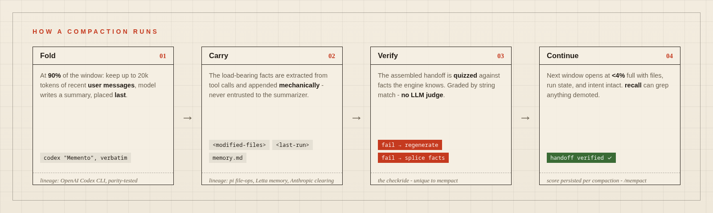
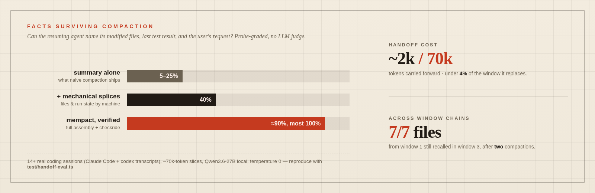

<p align="center">
  
</p>

<p align="center">
  
  
  <a href="reference/PIN.md"></a>
  
</p>

# mempact

**Verified context compaction for coding agents.** When context fills up,
every framework replaces the conversation with a model-written summary -
and none of them check it. Measured on real sessions, an agent resuming
from that summary alone can answer as little as **5%** of basic questions
about its own task: which files did we change, what did the last test
say, what was I asked to do. mempact fixes this two ways: the
load-bearing facts travel **by machine**, and every handoff is **tested
before it ships**.

Zero-dependency TypeScript core for any harness or local model, plus a
drop-in [pi coding agent](https://github.com/badlogic/pi-mono) extension
that hot-swaps pi's default compaction in one settings line.

## How it works

 Carry (mechanical fact splices) -> Verify (the checkride) -> Continue" width="100%">

1. **Fold** - the proven base: OpenAI Codex's compaction algorithm
   ("Memento"), ported verbatim with byte-exact parity tests.
2. **Carry** - file lists, last command + exit code, and unresolved
   errors are extracted from tool calls and appended to every summary
   mechanically; a `.mempact/memory.md` the model maintains is injected
   fresh every request, so it survives compaction by construction. Old
   tool outputs are cleared to one-line stubs and a `recall` tool can
   grep anything back - demotion, never deletion.
3. **Verify** - the **handoff checkride**, which exists nowhere else:
   the assembled post-compaction context is quizzed against facts the
   engine knows, graded by string matching (no LLM judge). Fail once →
   regenerate the summary with MUST-PRESERVE lines. Fail twice → splice
   the facts in verbatim. Compaction is never blocked; the score is
   persisted per compaction.

The methods in tiers 1-2 have direct research lineage - Codex's fold,
Anthropic's finding that mechanically clearing tool outputs beats
summarizing them, pi's deterministic file-op lists, Letta's pivot from
database memory tools to plain markdown memory files, Hermes's
stale-intent framing and anti-thrash guards. Tier 3 is the part nobody
else does: OpenAI gets reliable handoffs by *training* the model across
compaction boundaries (GPT-5.1-Codex-Max, behind an encrypted blob);
mempact gets them by *testing* the handoff - open, local, model-agnostic.

| | codex (remote) | Claude Code | Letta | Hermes | pi / OpenClaw | **mempact** |
|---|---|---|---|---|---|---|
| handoff verified? | trained, opaque | no | no | no | no | **every compaction** |

## Measured results



Probe-based post-compaction QA over **real** Claude Code and codex
session transcripts against a live 27B local model - the same method
Factory used to compare Anthropic's and OpenAI's compaction, but with
deterministic grading instead of an LLM judge. Notable: in two runs the
summarizer produced lazy 77-113 token summaries and the verified assembly
still carried 83-100% of the facts. Reproduce on your own sessions:

```bash
ENDPOINT=http://localhost:8080/v1 node test/handoff-eval.ts <session>.jsonl [more...]
# accepts Claude Code project transcripts and codex rollout files
# MEMORY_FILE=memory.md adds the memory-backed probes; CHAIN=1 tests window chains
```

## Install: hot-swap pi's compaction

```bash
pi install git:github.com/topmass/mempact
# or try it for one session without installing:
pi -e git:github.com/topmass/mempact
```

Then hand compaction timing fully to mempact in
`~/.pi/agent/settings.json` (mempact warns until you do):

```json
{ "compaction": { "enabled": false } }
```

That's the whole install - everything above is live on the next session.
`/mempact` shows the window chain, memory state, and last handoff score.
Knobs are module constants at the top of `pi/index.ts`
(`CHECKRIDE_ENABLED`, `CLEAR_TOOL_OUTPUTS_AT_FRACTION`, ...) and peel
back to the pure codex port. Degrades to silence, never breakage: no
model, no auth, or any checkride error → plain codex compaction ships.
Tested against pi 0.78-0.80.x.

## Standalone core

`core/` has no runtime dependencies and no pi imports - adapt your
harness's message types to its neutral model and you get the fold, the
truncation policies, the splices, and the checkride:

```ts
import {
  buildCompactedHistory, runCompactionWithRetry,       // codex base
  clearOldToolOutputs, collectFileOps, runFactsBlock,  // mechanical layers
  buildProbes, formatQuiz, gradeQuiz,                  // the checkride
} from "./core/index.ts";
```

## Development

```bash
pnpm install && pnpm test   # 116 vitest cases, incl. byte-exact codex parity
```

Base engine derived from [openai/codex](https://github.com/openai/codex)
@ `rust-v0.142.5` (Apache-2.0), Rust sources vendored under `reference/`,
prompts and constants verbatim. The mechanical layers, checkride, and
eval harness are original to this repo. Apache-2.0 throughout.
